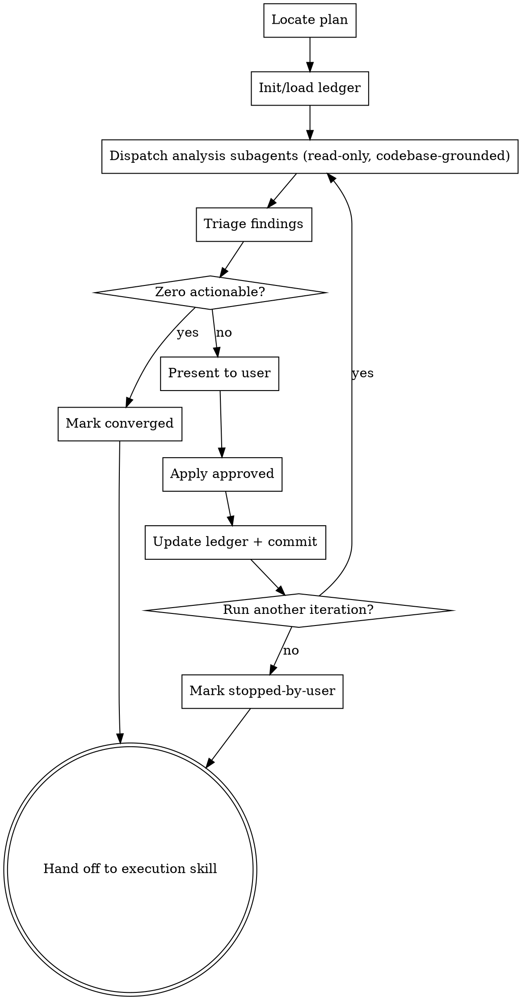

# Hardening Plans Skill — Implementation Plan

> **For agentic workers:** REQUIRED SUB-SKILL: Use superpowers:subagent-driven-development (recommended) or superpowers:executing-plans to implement this plan task-by-task. Steps use checkbox (`- [ ]`) syntax for tracking.

**Goal:** Add the `hardening-plans` skill — a subagent-driven, iterative review stage that runs after `writing-plans` and before `executing-plans` / `subagent-driven-development`, hardening the plan against issues and improvements grounded in the actual codebase.

**Architecture:** New skill at `skills/hardening-plans/` containing `SKILL.md` (process + ledger format) and `subagent-prompts.md` (analysis dispatch template). Three existing skills are updated to integrate it: `writing-plans` hands off to it, `executing-plans` and `subagent-driven-development` add a precondition check on the ledger file. A test fixture and driver script verify the loop end-to-end.

**Tech Stack:** Markdown skill files only. Test driver in bash. No runtime code.

**Spec:** [docs/superpowers/specs/2026-05-05-hardening-plans-design.md](../specs/2026-05-05-hardening-plans-design.md)

---

## File Structure

**Created files:**

- `skills/hardening-plans/SKILL.md` — skill content: frontmatter, announce phrase, checklist, process flow diagram, ledger format, key principles, execution handoff section that moves over from writing-plans.
- `skills/hardening-plans/subagent-prompts.md` — dispatch prompt template for analysis subagents (one per concern axis).
- `tests/hardening-plans/sample-plan.md` — deliberately-flawed sample plan with seeded issues across all five axes (ISSUES, UX, reusability, security, performance).
- `tests/hardening-plans/test.sh` — bash driver that exercises the skill against the fixture and asserts ledger creation, per-axis findings, convergence on iteration 2, and non-empty plan diff.

**Modified files:**

- `skills/writing-plans/SKILL.md` — replace the "Execution Handoff" section with a "Hardening Handoff" that invokes `hardening-plans`. The plan-header line that points engineers at execution skills stays unchanged (engineers reading the plan still go straight to execution skills; only the writing-plans flow changes).
- `skills/executing-plans/SKILL.md` — Step 1 gains a precondition check on the ledger file.
- `skills/subagent-driven-development/SKILL.md` — same precondition check at the top of "The Process".

---

## Task 1: Create skill skeleton

**Files:**
- Create: `skills/hardening-plans/SKILL.md`

- [ ] **Step 1: Create the skill file with frontmatter and overview**

```markdown
---
name: hardening-plans
description: Use when an implementation plan has been written and before it is executed - iteratively analyzes the plan for issues (architectural gaps, bugs) and improvements (UX, reusability, security, performance) using parallel subagents grounded in the current codebase, applies approved findings to the plan in place, and tracks iterations in a ledger file
---

# Hardening Plans

## Overview

After a plan is written and before it is executed, harden it. Dispatch parallel subagents to analyze the plan across two axes — ISSUES (architectural gaps, introduced bugs) and IMPROVEMENTS (UX, reusability, security, performance) — grounded in the actual current codebase. Triage findings, get user approval, edit the plan in place. Iterate until convergence or the user stops.

The terminal goal: produce the maximally-detailed plan ready for handoff to implementation.

**Announce at start:** "I'm using the hardening-plans skill to harden the implementation plan."
```

- [ ] **Step 2: Verify file created**

Run: `ls skills/hardening-plans/SKILL.md && head -10 skills/hardening-plans/SKILL.md`
Expected: file exists; first line is `---`, frontmatter contains `name: hardening-plans`.

- [ ] **Step 3: Commit**

```bash
git add skills/hardening-plans/SKILL.md
git commit -m "Add hardening-plans skill skeleton"
```

---

## Task 2: Add checklist and process flow to SKILL.md

**Files:**
- Modify: `skills/hardening-plans/SKILL.md` (append)

- [ ] **Step 1: Append the checklist section**

Append this content to `skills/hardening-plans/SKILL.md`:

````markdown

## Checklist

You MUST create a task for each of these items and complete them in order:

1. **Locate plan file** — explicit path, or most recent in `docs/superpowers/plans/`. Ask user if ambiguous.
2. **Initialize or load ledger** — `docs/superpowers/plans/<plan-basename>-hardening.md`. If status is already `converged` or `stopped-by-user`, ask the user whether to start a new iteration or exit.
3. **Run an iteration** (loop):
   1. Dispatch parallel analysis subagents (delegate decomposition to `superpowers:dispatching-parallel-agents`). See `subagent-prompts.md` for the prompt template.
   2. Triage findings (drop ledger-rejected duplicates, merge overlaps, drop noise).
   3. If zero actionable findings remain → write convergence entry, set status `converged`, exit loop.
   4. Present findings to user, get per-finding approval.
   5. Apply approved findings as edits to the plan file.
   6. Append iteration entry to ledger.
   7. Commit plan + ledger together.
   8. Ask user: "Run another hardening iteration?". If no → set status `stopped-by-user`, exit.
4. **Hand off** — invoke `superpowers:subagent-driven-development` (recommended) or `superpowers:executing-plans`.

## Process Flow


````

- [ ] **Step 2: Verify**

Run: `grep -c "^## " skills/hardening-plans/SKILL.md`
Expected: `3` (Overview, Checklist, Process Flow). After Task 3 appends its sections, this count will rise to `12`.

- [ ] **Step 3: Commit**

```bash
git add skills/hardening-plans/SKILL.md
git commit -m "hardening-plans: add checklist and process flow"
```

---

## Task 3: Add ledger format and dispatch instructions to SKILL.md

**Files:**
- Modify: `skills/hardening-plans/SKILL.md` (append)

- [ ] **Step 1: Append ledger format and dispatch sections**

Append to `skills/hardening-plans/SKILL.md`:

````markdown

## Ledger File

**Path:** `docs/superpowers/plans/<plan-basename>-hardening.md`

The ledger is the source of truth for iteration history, convergence detection, and finding deduplication across sessions. Plan and ledger are committed together each iteration so changes are reversible via git.

**Header (created on first iteration):**

```markdown
# Hardening Ledger: <plan-name>

**Plan:** [<plan-name>.md](./<plan-name>.md)
**Status:** in-progress | converged | stopped-by-user

---
```

**Iteration entry (one per iteration):**

```markdown
## Iteration N — YYYY-MM-DD HH:MM

**Dispatched concerns:** ISSUES, UX, reusability, security, performance
**Codebase commit at analysis:** <git-sha>

### Findings

#### F-N.1 — [severity: high|med|low] — [axis] — <short title>
- **Location in plan:** Task 3, Step 2
- **Description:** ...
- **Suggested change:** ...
- **Rationale (incl. codebase grounding):** ...
- **Decision:** applied | rejected | deferred
- **Reason (if rejected/deferred):** ...
- **Plan diff:** <one-line summary of edit, or "n/a">

### Iteration summary
- Findings raised: X | applied: Y | rejected: Z | deferred: W
- Plan commit: <sha>
```

A convergence iteration uses the same structure with `Findings raised: 0` and flips status to `converged`.

## Dispatching Analysis Subagents

Delegate decomposition to `superpowers:dispatching-parallel-agents`. That skill decides whether to dispatch one agent per concern axis, fewer combined agents, or some other split — based on plan size and concern overlap.

Each dispatched subagent receives the prompt at `skills/hardening-plans/subagent-prompts.md`, parameterized with:

- The full plan content.
- The concern axis the subagent owns.
- A summary of previously-rejected findings from the ledger (so they are not re-raised).
- Instruction to read the actual codebase (not just plan text). Findings must cite codebase evidence.

**Read-only constraint:** Per `AGENTS.md` Section 0.5, analysis subagents MUST NOT modify files, ask the user questions, or run state-changing commands. The dispatch prompt enforces this.

**Reference skills the subagent may use to sharpen analysis:**

- `superpowers:systematic-debugging` — for ISSUES axis.
- `superpowers:test-driven-development` — for testing-coverage gaps.
- `superpowers:verification-before-completion` — for verification-step gaps.

## Triage

After subagents return:

1. Drop findings that duplicate items the ledger already records as `rejected`.
2. Merge findings that overlap across axes (one finding can be cited under multiple axes).
3. Drop low-signal noise (e.g. style nits unrelated to the plan's deliverables).
4. The remaining list is the "actionable findings" for this iteration. If empty after triage → convergence.

## User Approval

Present the triaged findings as a numbered list. The user approves, rejects, or defers each (or batches). Record the decision and reason for every finding in the ledger entry — including rejections and deferrals — so future iterations can dedupe against them.

**Never auto-apply findings.** The user always approves before any plan edit.

## Applying Findings

For each approved finding, edit the plan file in place: revise tasks, expand steps with concrete code/commands, add missing tasks, fix ordering bugs, add notes referencing the relevant files in the codebase. After applying, summarize the edit in one line for the ledger's `Plan diff` field of that finding.

## Iteration Termination

The loop ends when **either**:

- An iteration produces zero actionable findings after triage → status `converged`.
- The user declines another iteration → status `stopped-by-user`.

Both terminal states are valid handoffs to execution.

## Edge Cases

- **No plan file specified:** use most recently modified file in `docs/superpowers/plans/`. If ambiguous, ask the user.
- **Plan modified mid-iteration outside the skill:** detect via file hash check at iteration start; if changed, restart the iteration with a fresh read.
- **Subagent fails or returns malformed findings:** record the failure in the ledger, retry that single axis once. If it fails again, record `axis-failed` and continue with other axes; inform the user.
- **User rejects every finding in an iteration:** convergence is judged on *actionable findings after triage*; an iteration with all rejections still increments the ledger and may set `converged` if no actionable items remain.
- **Session resumed later:** the ledger is the resumption state. Read it, show the user the status, ask whether to run another iteration.

## Hardening Handoff

After the iteration loop exits (`converged` or `stopped-by-user`):

> "Plan hardened. Ledger at `<ledger-path>` (status: <status>). Two execution options:
>
> **1. Subagent-Driven (recommended)** — fresh subagent per task, review between tasks.
>
> **2. Inline Execution** — execute tasks in this session with checkpoints.
>
> Which approach?"

**If Subagent-Driven chosen:**
- **REQUIRED SUB-SKILL:** Use `superpowers:subagent-driven-development`.

**If Inline Execution chosen:**
- **REQUIRED SUB-SKILL:** Use `superpowers:executing-plans`.

## Key Principles

- **Grounded findings** — every finding cites specific codebase evidence.
- **User in control** — the main agent triages but never auto-applies findings.
- **Auditable iteration** — the ledger is the source of truth for convergence and dedup.
- **Read-only subagents** — analysis subagents never modify files or interact with the user.
- **YAGNI** — convergence stops the loop; do not invent findings to keep iterating.
````

- [ ] **Step 2: Verify**

Run: `grep -c "^## " skills/hardening-plans/SKILL.md`
Expected: `12` (Overview, Checklist, Process Flow, Ledger File, Dispatching Analysis Subagents, Triage, User Approval, Applying Findings, Iteration Termination, Edge Cases, Hardening Handoff, Key Principles).

- [ ] **Step 3: Commit**

```bash
git add skills/hardening-plans/SKILL.md
git commit -m "hardening-plans: add ledger format, triage, and handoff sections"
```

---

## Task 4: Create subagent-prompts.md

**Files:**
- Create: `skills/hardening-plans/subagent-prompts.md`

- [ ] **Step 1: Create the prompt template file**

Create `skills/hardening-plans/subagent-prompts.md` with this exact content:

````markdown
# Hardening-Plans Analysis Subagent Prompt

Use this template when dispatching analysis subagents from the `hardening-plans` skill. Substitute the bracketed placeholders.

---

ROLE: Plan-hardening analyst — `<AXIS>` concern.

INPUTS:
- Plan content (full):
  ```
  <PLAN_CONTENT>
  ```
- Codebase root: `<REPO_ROOT>`
- Previously-rejected findings (do NOT re-raise verbatim):
  ```
  <LEDGER_REJECTED_EXCERPT>
  ```

TASK:
1. Read the plan thoroughly.
2. READ THE ACTUAL CODEBASE — open the files the plan touches, follow imports, check existing patterns. Findings MUST be grounded in current code, not in plan text alone.
3. Apply your concern lens (`<AXIS>`):
   - **ISSUES**: architectural gaps, missing tasks, ordering bugs, test coverage gaps, race conditions, breaking changes, integration mismatches with existing code.
   - **UX**: developer/end-user experience surfaced by the plan's deliverables — clarity of errors, defaults, accessibility, friction.
   - **reusability**: code the plan duplicates that already exists; opportunities to extract shared modules; unnecessary new abstractions.
   - **security**: OWASP Top 10, input validation, authn/authz, secret handling, dependency risks introduced.
   - **performance**: O(N) regressions, N+1 queries, blocking I/O, missing caching/batching, large-file/list handling.
4. You MAY reference these superpowers skills if they sharpen analysis:
   - `superpowers:systematic-debugging` (for ISSUES)
   - `superpowers:test-driven-development` (for testing gaps)
   - `superpowers:verification-before-completion` (for verification gaps)

OUTPUT FORMAT (return as your final report):

```
# Findings — <AXIS>

## F.1
- severity: high | med | low
- location_in_plan: Task <N>, Step <M>   (or "global" if cross-cutting)
- description: <what's wrong or what could be better>
- suggested_change: <concrete edit to the plan>
- rationale: <why, with codebase evidence — file paths, line refs, or "n/a" with reason>

## F.2
...
```

If you find nothing actionable, return:
```
# Findings — <AXIS>
(no findings)
```

CONSTRAINTS (READ-ONLY — STRICTLY ENFORCED):
- Do NOT create, modify, or delete any files.
- Do NOT run state-changing commands (git commit, package installs, etc.).
- Do NOT ask the user questions or invoke any interactive tool.
- Search, read, and analyze only.
- Return all findings in your final report.
````

- [ ] **Step 2: Verify**

Run: `ls skills/hardening-plans/subagent-prompts.md && grep -c "AXIS" skills/hardening-plans/subagent-prompts.md`
Expected: file exists; `AXIS` occurs at least 3 times.

- [ ] **Step 3: Commit**

```bash
git add skills/hardening-plans/subagent-prompts.md
git commit -m "hardening-plans: add analysis subagent prompt template"
```

---

## Task 5: Update writing-plans to hand off to hardening-plans

**Files:**
- Modify: `skills/writing-plans/SKILL.md:134-152` (replace the "Execution Handoff" section with a "Hardening Handoff")

- [ ] **Step 1: Replace the Execution Handoff section**

Open `skills/writing-plans/SKILL.md` and replace the section that begins with `## Execution Handoff` and runs to the end of the file with:

```markdown
## Hardening Handoff

After saving the plan, hand off to the hardening stage:

**"Plan complete and saved to `docs/superpowers/plans/<filename>.md`. Now hardening it before execution."**

- **REQUIRED SUB-SKILL:** Use `superpowers:hardening-plans`.

The hardening skill will iteratively review the plan, then hand off to execution. Do NOT invoke `executing-plans` or `subagent-driven-development` directly from here — `hardening-plans` is the next step.
```

The plan-document-header line at line 52 (which tells engineers reading the plan to use `subagent-driven-development` or `executing-plans`) stays unchanged: that line is for engineers reading a hardened plan, and they go straight to execution.

- [ ] **Step 2: Verify**

Run:
```bash
grep -c "Hardening Handoff" skills/writing-plans/SKILL.md
grep -c "Execution Handoff" skills/writing-plans/SKILL.md
grep "hardening-plans" skills/writing-plans/SKILL.md
```
Expected: `1`, `0`, at least one matching line referencing `superpowers:hardening-plans`.

- [ ] **Step 3: Commit**

```bash
git add skills/writing-plans/SKILL.md
git commit -m "writing-plans: hand off to hardening-plans instead of execution"
```

---

## Task 6: Add precondition check to executing-plans

**Files:**
- Modify: `skills/executing-plans/SKILL.md` (modify Step 1 of "The Process")

- [ ] **Step 1: Insert the precondition into Step 1**

Locate the section in `skills/executing-plans/SKILL.md` that reads:

```markdown
### Step 1: Load and Review Plan
1. Read plan file
2. Review critically - identify any questions or concerns about the plan
3. If concerns: Raise them with your human partner before starting
4. If no concerns: Create TodoWrite and proceed
```

Replace it with:

```markdown
### Step 1: Load and Review Plan
1. Read plan file
2. **Precondition check:** Look for the hardening ledger at `docs/superpowers/plans/<plan-basename>-hardening.md`.
   - If the ledger does not exist, OR its `Status:` line is neither `converged` nor `stopped-by-user`: STOP and invoke `superpowers:hardening-plans` first. Do not proceed to execution until hardening is complete.
   - If the ledger exists with status `converged` or `stopped-by-user`: proceed.
3. Review critically - identify any questions or concerns about the plan
4. If concerns: Raise them with your human partner before starting
5. If no concerns: Create TodoWrite and proceed
```

- [ ] **Step 2: Verify**

Run: `grep -A2 "Precondition check" skills/executing-plans/SKILL.md`
Expected: prints the precondition lines including the ledger path.

- [ ] **Step 3: Commit**

```bash
git add skills/executing-plans/SKILL.md
git commit -m "executing-plans: require hardening ledger before execution"
```

---

## Task 7: Add precondition check to subagent-driven-development

**Files:**
- Modify: `skills/subagent-driven-development/SKILL.md` (insert at the start of "The Process")

- [ ] **Step 1: Insert precondition before the existing process flow**

Locate the line `## The Process` in `skills/subagent-driven-development/SKILL.md`. Immediately after that heading, insert this paragraph BEFORE the existing `digraph process` graphviz block:

```markdown
**Precondition: hardening ledger present.** Before reading the plan, look for the ledger at `docs/superpowers/plans/<plan-basename>-hardening.md`. If it does not exist, OR its `Status:` line is neither `converged` nor `stopped-by-user`, STOP and invoke `superpowers:hardening-plans` first. Do not begin task dispatch until hardening is complete.

```

(Note the trailing blank line — keep one blank line between this paragraph and the `\`\`\`dot` fence that follows.)

- [ ] **Step 2: Verify**

Run: `grep -A1 "Precondition: hardening ledger" skills/subagent-driven-development/SKILL.md`
Expected: prints the precondition paragraph.

- [ ] **Step 3: Commit**

```bash
git add skills/subagent-driven-development/SKILL.md
git commit -m "subagent-driven-development: require hardening ledger before execution"
```

---

## Task 8: Create test fixture (deliberately-flawed sample plan)

**Files:**
- Create: `tests/hardening-plans/sample-plan.md`

- [ ] **Step 1: Create the fixture directory and plan**

Create `tests/hardening-plans/sample-plan.md` with this content. Each section is intentionally flawed so analysis subagents have material across all five axes. Comments mark which axis each flaw is meant to surface — they stay in the file because they are content the test harness inspects:

````markdown
# Toy URL-Shortener Implementation Plan

> **For agentic workers:** REQUIRED SUB-SKILL: Use superpowers:subagent-driven-development.

**Goal:** Add a `/shorten` HTTP endpoint that converts long URLs to short codes.

**Architecture:** Single Express handler, in-memory map.

**Tech Stack:** Node.js, Express.

---

## Task 1: Endpoint

**Files:**
- Create: `src/shorten.js`

- [ ] **Step 1: Implement endpoint**

```javascript
// SEEDED-FLAW [security]: no input validation; long-URL is used unsanitized.
// SEEDED-FLAW [reusability]: duplicates the random-id helper already at src/util/id.js.
// SEEDED-FLAW [performance]: linear scan over the entire map on every request.
const map = {};
app.post('/shorten', (req, res) => {
  const code = Math.random().toString(36).slice(2, 8);
  for (const k of Object.keys(map)) { /* collision check */ }
  map[code] = req.body.url;
  res.send(code);
});
```

- [ ] **Step 2: Commit**

## Task 2: Redirect

<!-- SEEDED-FLAW [ISSUES]: redirect handler referenced by Task 3 tests is never implemented here. -->

## Task 3: Tests

- [ ] **Step 1: Run tests**

```bash
npm test
```

<!-- SEEDED-FLAW [UX]: no error message format documented; user sees raw stack traces. -->
<!-- SEEDED-FLAW [ISSUES]: no failing-test-first step; jumps straight to "run tests". -->
````

- [ ] **Step 2: Verify**

Run: `grep -c "SEEDED-FLAW" tests/hardening-plans/sample-plan.md`
Expected: `6` (one per axis plus extras).

- [ ] **Step 3: Commit**

```bash
git add tests/hardening-plans/sample-plan.md
git commit -m "tests/hardening-plans: add deliberately-flawed sample plan fixture"
```

---

## Task 9: Create test driver script

**Files:**
- Create: `tests/hardening-plans/test.sh`

- [ ] **Step 1: Create the bash driver**

Create `tests/hardening-plans/test.sh`. This is an *agent-facing* harness: the assertions run after a human or CI agent has driven the skill against the fixture. It checks the artifacts the skill produces, not the dispatch logic itself (which lives in the agent runtime).

```bash
#!/usr/bin/env bash
# Verifies the artifacts hardening-plans produces against the fixture plan.
# Usage:
#   bash tests/hardening-plans/test.sh <copy-of-sample-plan.md> <ledger.md>
# Exits 0 on pass, non-zero on failure.

set -euo pipefail

PLAN="${1:?path to plan file (post-hardening) required}"
LEDGER="${2:?path to ledger file required}"

fail() { echo "FAIL: $*" >&2; exit 1; }

[[ -f "$PLAN"   ]] || fail "plan file not found at $PLAN"
[[ -f "$LEDGER" ]] || fail "ledger file not found at $LEDGER"

# 1. Ledger header sanity.
grep -q "^# Hardening Ledger:" "$LEDGER" || fail "ledger missing header"
grep -qE "^\*\*Status:\*\* (in-progress|converged|stopped-by-user)" "$LEDGER" \
  || fail "ledger missing Status line"

# 2. At least one iteration recorded.
grep -qE "^## Iteration 1 " "$LEDGER" || fail "ledger missing Iteration 1"

# 3. At least one finding per axis raised in iteration 1.
for axis in ISSUES UX reusability security performance; do
  grep -q "$axis" "$LEDGER" || fail "no '$axis' finding recorded in ledger"
done

# 4. Plan was modified — at least one SEEDED-FLAW comment should be addressed
#    (i.e., the plan diff should reduce the SEEDED-FLAW count or the surrounding
#    code should have changed). We use the count as a coarse signal.
ORIG_FLAWS=6
CUR_FLAWS=$(grep -c "SEEDED-FLAW" "$PLAN" || true)
[[ "$CUR_FLAWS" -lt "$ORIG_FLAWS" ]] \
  || fail "plan does not appear to have been hardened (SEEDED-FLAW count unchanged: $CUR_FLAWS)"

# 5. If the ledger reports a second iteration, it must converge.
if grep -qE "^## Iteration 2 " "$LEDGER"; then
  awk '/^## Iteration 2 /{flag=1} flag && /^- Findings raised: /{print; exit}' "$LEDGER" \
    | grep -q "Findings raised: 0" \
    || fail "iteration 2 present but did not converge (expected 'Findings raised: 0')"
fi

echo "PASS: hardening-plans artifacts look correct"
```

- [ ] **Step 2: Make executable and verify**

Run:
```bash
chmod +x tests/hardening-plans/test.sh
bash -n tests/hardening-plans/test.sh
```
Expected: no output (syntax OK).

- [ ] **Step 3: Smoke-test the driver against the unmodified fixture (must FAIL)**

Run:
```bash
bash tests/hardening-plans/test.sh tests/hardening-plans/sample-plan.md /dev/null || echo EXPECTED_FAIL
```
Expected: prints `FAIL: ledger file not found at /dev/null` (then `EXPECTED_FAIL`). This proves the driver actually checks its preconditions.

- [ ] **Step 4: Commit**

```bash
git add tests/hardening-plans/test.sh
git commit -m "tests/hardening-plans: add artifact verification driver"
```

---

## Task 10: Final integration check

**Files:**
- (read-only verification across the changed skills)

- [ ] **Step 1: Confirm the chain of references is intact (specific patterns, not generic substring)**

Run:
```bash
grep -q "Hardening Handoff" skills/writing-plans/SKILL.md && \
grep -q "superpowers:hardening-plans" skills/writing-plans/SKILL.md && \
grep -q "Precondition for Execution Skills" skills/executing-plans/SKILL.md && \
grep -q "Precondition: hardening ledger present and verified" skills/subagent-driven-development/SKILL.md && \
echo "OK: integration patterns present in all three skills"
```
Expected: prints `OK: integration patterns present in all three skills`. If the command exits non-zero, the integration in Task 5/6/7 was not committed correctly.

- [ ] **Step 2: Confirm the new skill self-references are intact**

Run:
```bash
grep -E "subagent-prompts.md|dispatching-parallel-agents|systematic-debugging" skills/hardening-plans/SKILL.md
```
Expected: at least three matching lines.

- [ ] **Step 3: Confirm SKILL.md frontmatter is well-formed**

Run:
```bash
head -4 skills/hardening-plans/SKILL.md
```
Expected: starts with `---`, contains `name: hardening-plans`, contains `description:`, ends frontmatter with `---`.

- [ ] **Step 4: Final commit (no-op confirmation)**

If `git status` shows clean, no commit is needed. Otherwise, investigate stray changes before merging.

```bash
git status
```
Expected: `nothing to commit, working tree clean`.
