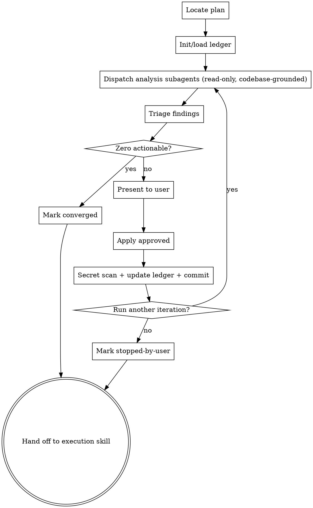

# Hardening Plans

## Overview

After a plan is written and before it is executed, harden it. Dispatch parallel subagents to analyze the plan across two axes — ISSUES (architectural gaps, introduced bugs) and IMPROVEMENTS (UX, reusability, security, performance) — grounded in the actual current codebase. Triage findings, get user approval, edit the plan in place. Iterate until convergence or the user stops.

The terminal goal: produce the maximally-detailed plan ready for handoff to implementation.

**Announce at start:** "I'm using the hardening-plans skill to harden the implementation plan."

## Concern Axes

<!-- canonical axis list — other files (subagent-prompts.md, tests/hardening-plans/test.sh, fixture) reference this list. Keep in sync. -->

The skill analyzes the plan along these five axes:

1. **ISSUES** — architectural gaps, missing tasks, ordering bugs, race conditions, breaking changes, integration mismatches.
2. **UX** — developer/end-user experience surfaced by the plan's deliverables.
3. **reusability** — code the plan duplicates that already exists; extractable shared modules.
4. **security** — OWASP Top 10, input validation, authn/authz, secret handling, dependency risks.
5. **performance** — O(N) regressions, N+1 queries, blocking I/O, missing caching/batching.

## Checklist

You MUST create a task for each of these items and complete them in order:

1. **Locate plan file** — explicit path, or most recent in `docs/superpowers/plans/`. Ask user if ambiguous. Remember the path; you will pass it to the execution skill at handoff (see Hardening Handoff).
2. **Initialize or load ledger** — `docs/superpowers/plans/<plan-basename>-hardening.md`. If status is already `converged` or `stopped-by-user`, ask the user (using the Resumption Prompt template below) whether to run another iteration or skip to execution.
3. **Run an iteration** (loop):
   1. Dispatch parallel analysis subagents (default decomposition: one read-only subagent per axis = 5 total). Follow `superpowers:dispatching-parallel-agents` for the parallel-dispatch pattern. See `subagent-prompts.md` for the prompt template.
   2. Triage findings (drop ledger-rejected duplicates, merge overlaps, drop noise).
   3. If zero actionable findings remain → write convergence entry, set status `converged`, exit loop.
   4. Present findings to user using the Findings Presentation template, get per-finding approval.
   5. Apply approved findings as edits to the plan file.
   6. Append iteration entry to ledger.
   7. Scan the ledger for accidental secret leakage (see "Secret Scan" below) before committing.
   8. Commit plan + ledger together.
   9. Ask user: "Run another hardening iteration?" using the Iteration-Continuation Prompt. If no → set status `stopped-by-user`, exit.
4. **Hand off** — invoke `superpowers:subagent-driven-development` (recommended) or `superpowers:executing-plans`, passing the plan file path explicitly.

## Process Flow



## Ledger File

**Path:** `docs/superpowers/plans/<plan-basename>-hardening.md`

The ledger is the source of truth for iteration history, convergence detection, and finding deduplication across sessions. Plan and ledger are committed together each iteration so changes are reversible via git.

**Ledger path derivation.** Given a plan at `docs/superpowers/plans/<X>.md`, the ledger is `docs/superpowers/plans/<X>-hardening.md`. Always pass the plan path forward at handoff so downstream skills can derive the same ledger path.

**Header (created on first iteration):**

```markdown
# Hardening Ledger: <plan-name>

**Plan:** [<plan-name>.md](./<plan-name>.md)
**Status:** in-progress | converged | stopped-by-user
**Verified at commit:** <git-sha-after-last-iteration-commit>

---
```

The `Verified at commit` line is written after each iteration's commit and points at that commit. Execution skills compare it to `git log` for that ledger file (see "Precondition for Execution Skills" below) — defense in depth against accidental ledger tampering. The git history is the real audit trail; this line is a fast-path check.

**Iteration entry (one per iteration):**

```markdown
## Iteration N — YYYY-MM-DD HH:MM

**Dispatched concerns:** ISSUES, UX, reusability, security, performance
**Codebase commit at analysis:** <git-sha>

### Findings

#### F-N.1 — [severity: high|med|low] — [axis] — <short title>
- **Location in plan:** Task 3, Step 2
- **Description:** ...
- **Suggested change:** ...
- **Rationale (incl. codebase grounding):** ...
- **Decision:** applied | rejected | deferred
- **Reason (if rejected/deferred):** ...
- **Plan diff:** <one-line summary; OR a bulleted list if a single finding required multiple edits>

### Iteration summary
- Findings raised: X | applied: Y | rejected: Z | deferred: W
- Plan commit: <sha>
```

**Decision field glossary:**

- `applied` — finding was approved and incorporated into the plan.
- `rejected` — finding was explicitly declined as out of scope or incorrect.
- `deferred` — finding is valid but intentionally postponed (later phase, depends on other work, user prefers a later iteration).

The `Reason` field is mandatory for `rejected` and `deferred` so future iterations have context.

A convergence iteration uses the same structure with `Findings raised: 0` and flips status to `converged`.

## Dispatching Analysis Subagents

**Default decomposition.** Dispatch one read-only subagent per axis listed in "Concern Axes" — five total, in parallel. This is the default; an agent may collapse axes (e.g., combine reusability + performance) only if the plan is small enough that five subagents would each have <100 LOC of plan to analyze.

Follow the parallel-dispatch pattern from `superpowers:dispatching-parallel-agents`. Use the prompt template at `skills/hardening-plans/subagent-prompts.md`, parameterized with:

- The plan content (or, see "Token-cost guidance" below, an axis-relevant excerpt).
- The concern axis the subagent owns.
- Previously-rejected findings (compact, ledger-derived, see "Carrying findings forward").
- Previously-applied findings from iteration N-1 (so this iteration focuses on new gaps, not rediscovery).
- Codebase root path.

**Read-only constraint.** Per `AGENTS.md` Section 0.5, analysis subagents MUST NOT modify files, ask the user questions, or run state-changing commands. The dispatch prompt enforces this in text, but **the binding enforcement is at the platform tool layer** — the subagent's available tools must exclude write tools, terminal write commands, and interactive prompts. If your platform cannot enforce this, do not run hardening-plans against untrusted plan content.

**Concept references (NOT skill invocations).** Subagents may *consider concepts* from these skills when analyzing the plan, but MUST NOT invoke them (those skills require write/interactive tools that are forbidden):

- `superpowers:systematic-debugging` — root-cause tracing, precondition discipline (for ISSUES).
- `superpowers:test-driven-development` — test-first discipline, coverage gaps (for testing-related findings).
- `superpowers:verification-before-completion` — missing verification steps (for verification gaps).

**Token-cost guidance.** If the plan exceeds ~20KB, send each subagent only an axis-relevant excerpt (task headers, file paths, plus the steps in tasks the axis cares about) plus a compact "plan map" (task titles + files-touched table). When ≤20KB, send the full plan.

**Codebase scoping for subagents.** "Read the actual codebase" is bounded — instruct the subagent to:
- Read only files explicitly touched by the plan, plus their *direct* imports.
- Stop following imports past depth 2.
- Skip `node_modules/`, `venv/`, build outputs, and other vendor/generated directories unless the plan touches them.
- For files >50 LOC reached only via indirect import, read only exported interfaces.

**Carrying findings forward.** Each iteration's dispatch includes a compact summary of:
- All findings the ledger marks `rejected` (so subagents do not re-raise them).
- All findings from iteration N-1 marked `applied` (so subagents focus on what's still missing instead of rediscovering already-fixed issues).

A compact summary entry is `F-<N>.<X>: [axis] <title> — <decision>` (one line per finding).

## Triage

After subagents return:

1. Drop findings that duplicate items the ledger already records as `rejected`. A duplicate matches if location-in-plan is the same AND title or description is substantially the same; minor wording differences still count as duplicates. If a finding is structurally different but addresses the same surface, do not auto-drop — flag it for the user.
2. Merge findings that overlap across axes; record the merged finding once, citing both originating axes.
3. Drop low-signal noise (style nits unrelated to the plan's deliverables, speculative future-work findings).
4. The remaining list is "actionable findings" for this iteration. If empty after triage → convergence.

You may report triage stats to the user for transparency, e.g. "10 raw findings; 2 ledger-rejected duplicates dropped, 2 merged across axes, 1 noise dropped → 5 actionable."

## Findings Presentation Template

When presenting actionable findings to the user, use this structure:

```
I found <N> actionable findings. (<triage-stats-line, optional>)

### <severity-tier>

**F.<n> — [<axis>] — <title>**
- Location: <task/step or "global">
- Issue: <description>
- Fix: <concrete change>

[repeat for each finding]

Approve, reject, or defer each (or batch by tier). Reply like:
- "F.1, F.3: approve. F.2: defer (phase 2). F.4-F.6: approve all."
```

Group findings by severity tier (HIGH / MED / LOW) for readability.

## User Approval

The user approves, rejects, or defers each finding (or batches). Record the decision and reason for every finding — including rejections and deferrals — so future iterations dedupe correctly.

**Never auto-apply findings.** The user always approves before any plan edit.

## Applying Findings

For each approved finding, edit the plan file in place: revise tasks, expand steps with concrete code/commands, add missing tasks, fix ordering bugs, add notes referencing the relevant files in the codebase.

**Recording the Plan diff.** In the ledger entry's `Plan diff` field, summarize each edit briefly. If a single finding triggered multiple edits, use a bulleted list:

```
- **Plan diff:**
  - Added Task 3 (input validation step)
  - Expanded Task 1 Step 2 with sanitization code
  - Reordered Task 5 to run before Task 4
```

## Secret Scan

Before committing the ledger, scan its content for common secret patterns. If matches appear, the rationale field captured a secret from the codebase by accident — redact before commit. Patterns to grep (case-insensitive):

- `api[_-]?key`, `secret`, `password`, `passwd`, `token`, `bearer`, `aws_access_key_id`, `aws_secret_access_key`
- Hex/base64 strings ≥32 chars adjacent to those keywords.

This is a guidance step — agents already have judgment about secrets. The point is to not skip the check.

## Iteration Termination

The loop ends when **either**:

- An iteration produces zero actionable findings after triage → status `converged`.
- The user declines another iteration → status `stopped-by-user`.

**All-rejected case.** If the user rejects every finding in iteration N, that iteration still records as completed. The next iteration runs and is judged on its own actionable count; the loop converges only when that count is zero. Rejection is not termination.

Both terminal states are valid handoffs to execution.

## Edge Cases

- **No plan file specified:** use most recently modified file in `docs/superpowers/plans/`. If ambiguous, ask the user.
- **Plan modified mid-iteration outside the skill:** detect via file hash check at iteration start; if changed, restart the iteration with a fresh read.
- **Subagent fails or returns malformed findings:** record the failure in the ledger, retry that single axis once. If it fails again, record `axis-failed` and continue with other axes; inform the user with the Axis-Failure Prompt below.
- **User rejects every finding in an iteration:** see "All-rejected case" above.
- **Session resumed later:** the ledger is the resumption state. Read it, show the user the status using the Resumption Prompt below, ask whether to run another iteration or skip to execution.

## User-Facing Prompt Templates

**Resumption Prompt** (when ledger already exists at start):

> "Existing hardening ledger found at `<ledger-path>` (status: `<status>`, last iteration: N).
>
> 1. **Run another iteration** — analyze the plan again for additional findings.
> 2. **Skip to execution** — the plan is ready; hand off now.
>
> Which would you prefer?"

**Iteration-Continuation Prompt** (after each iteration applies findings):

> "Iteration N applied: <Y> findings. Plan and ledger committed.
>
> Run another hardening iteration?"

**Axis-Failure Prompt** (when a subagent fails twice on one axis):

> "The `<AXIS>` analysis failed twice — recorded in the ledger as `axis-failed`. I'm continuing with the other axes. We can retry `<AXIS>` next iteration, or skip it. Should I continue?"

## Hardening Handoff

After the iteration loop exits (`converged` or `stopped-by-user`):

> "Plan hardened. Ledger at `<ledger-path>` (status: `<status>`). Two execution options:
>
> **1. Subagent-Driven (recommended)** — fresh subagent per task, review between tasks.
>
> **2. Inline Execution** — execute tasks in this session with checkpoints.
>
> Which approach?"

**Pass the plan file path explicitly** when invoking the chosen skill. Both execution skills derive the ledger path from the plan path and verify the precondition below.

**If Subagent-Driven chosen:**
- **REQUIRED SUB-SKILL:** Use `superpowers:subagent-driven-development`.

**If Inline Execution chosen:**
- **REQUIRED SUB-SKILL:** Use `superpowers:executing-plans`.

## Precondition for Execution Skills

`superpowers:executing-plans` and `superpowers:subagent-driven-development` both require this precondition before they begin. They cite this section rather than restating the wording.

> Given the plan path `docs/superpowers/plans/<X>.md`, derive the ledger path `docs/superpowers/plans/<X>-hardening.md`.
>
> 1. If the ledger does not exist → STOP and invoke `superpowers:hardening-plans`.
> 2. Read the ledger's `Status:` line.
>    - If status is `converged` or `stopped-by-user` → proceed.
>    - Otherwise → STOP and invoke `superpowers:hardening-plans`.
> 3. (Best-effort integrity check.) Read the `Verified at commit:` line. Confirm that sha is the most recent commit affecting the ledger file (`git log -1 --format=%H -- <ledger-path>`). If the file has been modified locally without a matching commit, warn the user before proceeding.

## Key Principles

- **Grounded findings** — every finding cites specific codebase evidence.
- **User in control** — the main agent triages but never auto-applies findings.
- **Auditable iteration** — the ledger is the source of truth for convergence and dedup.
- **Read-only subagents** — analysis subagents never modify files or interact with the user. Enforcement is at the platform tool layer.
- **YAGNI** — convergence stops the loop; do not invent findings to keep iterating.
