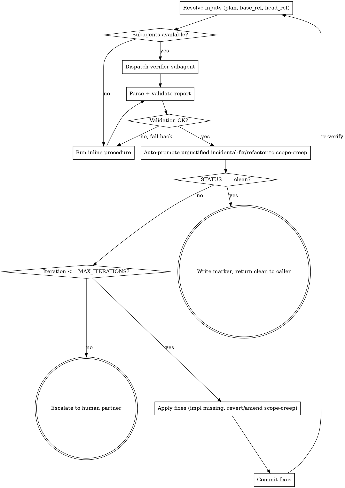

# Verifying Plan Completion

## Overview

End-of-plan completeness audit. Compares the written plan against the branch diff (merge-base → HEAD). Emits a structured report and drives a bounded fix-loop until the report is `clean` or escalates. Returns control to the caller (`executing-plans` or `subagent-driven-development`); never invokes `finishing-a-development-branch` directly.

**Announce at start:** "I'm using the verifying-plan-completion skill to audit plan-vs-implementation."

**Per-task verification is out of scope.** SDD's `spec-reviewer-prompt.md` continues to handle that. This skill runs once, at the end.

## Process Flow



## When to Use

- Invoked by `superpowers:executing-plans` after all tasks complete, before `finishing-a-development-branch`.
- Invoked by `superpowers:subagent-driven-development` after the per-task loop completes, replacing the "final code reviewer" step.
- Required precondition for `superpowers:finishing-a-development-branch` when invoked from a plan-execution context. This skill returns control to its caller; the caller (not this skill) invokes finishing.

## Inputs (controller resolves before dispatch)

The controller MUST resolve all of these before invoking the verifier — the verifier subagent is READ-ONLY and MUST NOT prompt the human partner.

- `plan_path` — passed by the invoker. If absent, list `docs/superpowers/plans/*.md` sorted by filename in reverse alphabetical order; pick the first; if none, STOP and point at `superpowers:writing-plans`.
- `base_ref` — required. Try `git merge-base HEAD main`, then `git merge-base HEAD master`. If both fail, ask the human partner before dispatch. Do NOT pass an unresolved `base_ref` to the verifier.
- `head_ref` — current `HEAD`.
- `branch_name`, `commit_list` — for the evidence table.

`spec_path` is NOT an input. The plan is the contract.

## Mode Selection

- **Subagent mode (preferred):** if the platform exposes a subagent-dispatch capability, dispatch a fresh verifier subagent using `./verifier-prompt.md`. The subagent is READ-ONLY (search, read, analyze; no writes; no human prompts).
- **Inline mode (fallback):** if the platform has no subagent capability, the controller follows the inline procedure in this file.

Decide the mode before entering the loop. Do NOT attempt dispatch and catch-on-failure.

## Output Schema (canonical)

The verifier emits exactly this shape. The schema lives here; `verifier-prompt.md` references this section. Do not duplicate the schema elsewhere.

```
STATUS: clean | gaps | scope-creep | both

MISSING:
- <task reference>: <quoted requirement>
  evidence searched:
    files: <paths>
    symbols/strings: <observables looked for>
    commits: <SHAs examined>

PARTIAL:
- <task reference>: <what is missing>

EXTRA:
- <file:lines>: <one-line description>
  classification: incidental-fix | refactor | scope-creep | unknown
  rationale: <one line — required for incidental-fix and refactor>

EVIDENCE TABLE:
| Plan item | Status | Commit(s) | File(s) |
```

`STATUS` is computed:
- `clean` if MISSING and PARTIAL are empty AND every EXTRA is `incidental-fix` or `refactor` with a valid rationale.
- `gaps` if MISSING or PARTIAL non-empty AND no EXTRA is `scope-creep`/`unknown`.
- `scope-creep` if any EXTRA is `scope-creep`/`unknown` AND MISSING and PARTIAL are empty.
- `both` if both kinds are present.

If a section is empty, output the header followed by `- (none)`.

## Classification Rules for EXTRA Items (canonical)

The classification table lives here. `verifier-prompt.md` references this section. Do not duplicate.

| Class | Definition | Verdict |
|---|---|---|
| `incidental-fix` | Bug uncovered while implementing a plan item; small; same area; no new public surface. Rationale must justify all four. | Pass |
| `refactor` | Restructuring without behavior change, in code touched by the plan, adding no new public API. (Test coverage is not the verifier's responsibility — the project test suite has already passed at this stage; coverage of refactored code is implicit.) | Pass |
| `scope-creep` | New features, new files, or new public APIs not mentioned in the plan. | Fail |
| `unknown` | Cannot trace to plan; not clearly incidental. | Treated as `scope-creep` |

After receiving the verifier's report, the controller MUST validate every `incidental-fix` and `refactor` rationale:

- `incidental-fix` rationale must explicitly cover all four conditions: bug-not-feature, small, same-area, no-new-public-surface.
- `refactor` rationale must explicitly cover: behavior-unchanged, plan-touched-files, no-new-public-API.
- Any classification missing or with insufficient rationale is auto-promoted to `scope-creep`. Recompute STATUS after promotion.

## Plan-vs-Diff Matching Procedure

Used by both inline mode and the verifier subagent.

1. Parse the plan: extract every `## Task N` heading and every `- [ ]` checkbox step. Each is a line-item.
2. For each line-item, extract observables: filenames mentioned, quoted strings, symbol names (function/class/constant identifiers), or quoted shell commands.
3. Compute `git diff <base_ref>..<head_ref>` and capture the per-file unified diff with at least 1 line of context.
4. For each line-item, search the diff hunk **content** (not file names alone) for the observables:
   - All observables match → `satisfied`.
   - Some observables match (e.g., file present but a quoted acceptance string is missing) → `partial`. Record what is missing.
   - None match, or only file names match without content → `missing`.
5. For each diff hunk not claimed by any line-item, classify per the canonical table. Record `<file:lines>`, classification, and a one-line rationale.

**Worked example using `tests/verifying-plan-completion/sample-plan.md`:**

- Task 2 says: file `feature-b.txt` whose first line is `feature-b: implemented` AND second line is `acceptance: AC-2 satisfied`.
- Observables: filename `feature-b.txt`, strings `feature-b: implemented`, `acceptance: AC-2 satisfied`.
- If the diff adds `feature-b.txt` containing only `feature-b: implemented` (no acceptance line) → `partial`, missing `acceptance: AC-2 satisfied`.

## Auto-Loop

```
MAX_ITERATIONS = 3   # empirical: most issues converge in <=2; 3 leaves one safety pass
iteration = 0

loop:
    report = verify(plan, base..head)
    apply controller-side rationale validation (auto-promote unjustified)
    if report.STATUS == "clean":
        write marker file (see "Clean Marker" below)
        return clean to caller
        break

    iteration += 1
    if iteration > MAX_ITERATIONS:
        emit Escalation Message (template below)
        STOP — return budget-exhausted to caller

    for each MISSING / PARTIAL:
        dispatch implementer (SDD) or fix inline (executing-plans)

    for each EXTRA where classification ∈ {scope-creep, unknown}:
        decide using the Scope-Creep Decision Rule below

    if any fixes applied:
        run project tests; if failing, ask human partner before committing
        git commit -m "fix: resolve plan-verification gaps (iteration <iteration>)"

    # human-amended plan path:
    if the human partner explicitly signals "plan amended":
        re-read plan; this iteration counts toward MAX_ITERATIONS
```

### Scope-Creep Decision Rule

For each `scope-creep` or `unknown` EXTRA:

1. If the human partner explicitly requested this work during execution → ask the human to amend the plan; on confirmation, re-run verification (counts as one iteration).
2. Otherwise → revert the hunk via `git revert -n <sha>` against the offending commit, or `git checkout <base_ref> -- <file>` for entirely new files; commit the revert.
3. When in doubt → ask the human partner. Default is NEVER to silently delete work.

### Clean Marker

When the loop returns `clean`, the controller writes a marker file at `.git/superpowers-plan-verification-clean` containing two lines:

```
plan: <absolute plan path>
head: <git rev-parse HEAD output at verification time>
```

`finishing-a-development-branch` reads this marker (see that skill's Step 1b) to confirm verification is current. The marker is removed at the end of `finishing-a-development-branch`.

### Termination

| Condition | Action |
|---|---|
| `STATUS: clean` | Write clean marker. Return control to caller. Caller (not this skill) invokes `finishing-a-development-branch`. |
| Loop budget exhausted | Emit Escalation Message; STOP; return budget-exhausted to caller. Do NOT proceed. |
| Human chooses to amend plan | Update plan doc, commit, re-verify (consumes one iteration). |

### Escalation Message Template

When budget is exhausted, emit verbatim to the human partner:

```
Plan-completion verification did not converge within <MAX_ITERATIONS> iterations.

Final status: <STATUS>
Iteration history:
- Iteration 1: <M> MISSING, <P> PARTIAL, <E> EXTRA (scope-creep: <Y>)
- Iteration 2: ...
- Iteration 3: ...

Final report:
<full structured report>

Next steps:
1. Review the findings above.
2. Either amend the plan to incorporate the EXTRA items, or fix the implementation to satisfy MISSING/PARTIAL items.
3. Re-invoke superpowers:verifying-plan-completion to continue.
```

## Output Validation (controller-side)

Before consuming the verifier's report, the controller MUST validate it:

- Begins with a single `STATUS: <clean|gaps|scope-creep|both>` line.
- Sections `MISSING:`, `PARTIAL:`, `EXTRA:`, `EVIDENCE TABLE:` are present (each may contain only `- (none)`).
- Every `EXTRA:` entry has both a `classification:` line (one of the four values) and, for `incidental-fix`/`refactor`, a non-empty `rationale:` line.

If validation fails:

1. Log the parse error.
2. Fall back to inline mode and re-run.
3. If inline-mode output also fails validation → escalate with: `"Verifier produced invalid report (subagent error: <X>; inline error: <Y>). Cannot audit plan completion automatically."`

## Error Handling

- No `plan_path` resolvable → STOP. Point at `superpowers:writing-plans`.
- No `base_ref` resolvable from `main`/`master` → controller asks the human partner before dispatch. Subagent never asks.
- Diff empty, plan non-empty → MISSING for every plan item; report normally.
- Subagent verifier fails or times out → fall back to inline procedure (see Output Validation above).
- Plan amended mid-loop → human partner explicitly signals; controller re-reads; counts as one iteration.

## Design Note: No Persistent Ledger

Unlike `superpowers:hardening-plans`, this skill is intentionally stateless across iterations. Each iteration regenerates the report from the current diff; persistence comes from git commits (one per fix iteration), not a ledger file. Rationale: verification is a closing audit (one final pass), whereas hardening is an iterative design process whose history must be reviewable and resumable across sessions.

## Integration

**Required workflow skills:**

- **superpowers:writing-plans** — produces the plan this skill audits.
- **superpowers:executing-plans** — invokes this skill before finishing.
- **superpowers:subagent-driven-development** — invokes this skill in place of the prior "final code reviewer" step.
- **superpowers:finishing-a-development-branch** — reads the clean marker written by this skill; invoked by the *caller*, not by this skill.

**Out of scope:**

- Per-task spec compliance (handled by SDD's `spec-reviewer-prompt.md`, unchanged).
- General "evidence before claims" gating (handled by `superpowers:verification-before-completion`).
