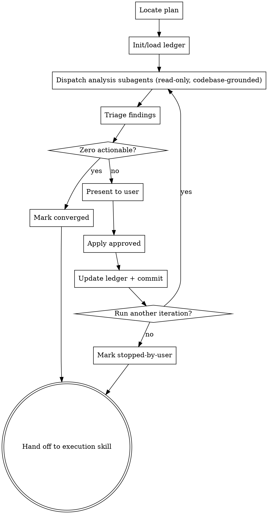

# Hardening Plans

## Overview

After a plan is written and before it is executed, harden it. Dispatch parallel subagents to analyze the plan across two axes — ISSUES (architectural gaps, introduced bugs) and IMPROVEMENTS (UX, reusability, security, performance) — grounded in the actual current codebase. Triage findings, get user approval, edit the plan in place. Iterate until convergence or the user stops.

The terminal goal: produce the maximally-detailed plan ready for handoff to implementation.

**Announce at start:** "I'm using the hardening-plans skill to harden the implementation plan."

## Checklist

You MUST create a task for each of these items and complete them in order:

1. **Locate plan file** — explicit path, or most recent in `docs/superpowers/plans/`. Ask user if ambiguous.
2. **Initialize or load ledger** — `docs/superpowers/plans/<plan-basename>-hardening.md`. If status is already `converged` or `stopped-by-user`, ask the user whether to start a new iteration or exit.
3. **Run an iteration** (loop):
   1. Dispatch parallel analysis subagents (delegate decomposition to `superpowers:dispatching-parallel-agents`). See `subagent-prompts.md` for the prompt template.
   2. Triage findings (drop ledger-rejected duplicates, merge overlaps, drop noise).
   3. If zero actionable findings remain → write convergence entry, set status `converged`, exit loop.
   4. Present findings to user, get per-finding approval.
   5. Apply approved findings as edits to the plan file.
   6. Append iteration entry to ledger.
   7. Commit plan + ledger together.
   8. Ask user: "Run another hardening iteration?". If no → set status `stopped-by-user`, exit.
4. **Hand off** — invoke `superpowers:subagent-driven-development` (recommended) or `superpowers:executing-plans`.

## Process Flow



## Ledger File

**Path:** `docs/superpowers/plans/<plan-basename>-hardening.md`

The ledger is the source of truth for iteration history, convergence detection, and finding deduplication across sessions. Plan and ledger are committed together each iteration so changes are reversible via git.

**Header (created on first iteration):**

```markdown
# Hardening Ledger: <plan-name>

**Plan:** [<plan-name>.md](./<plan-name>.md)
**Status:** in-progress | converged | stopped-by-user

---
```

**Iteration entry (one per iteration):**

```markdown
## Iteration N — YYYY-MM-DD HH:MM

**Dispatched concerns:** ISSUES, UX, reusability, security, performance
**Codebase commit at analysis:** <git-sha>

### Findings

#### F-N.1 — [severity: high|med|low] — [axis] — <short title>
- **Location in plan:** Task 3, Step 2
- **Description:** ...
- **Suggested change:** ...
- **Rationale (incl. codebase grounding):** ...
- **Decision:** applied | rejected | deferred
- **Reason (if rejected/deferred):** ...
- **Plan diff:** <one-line summary of edit, or "n/a">

### Iteration summary
- Findings raised: X | applied: Y | rejected: Z | deferred: W
- Plan commit: <sha>
```

A convergence iteration uses the same structure with `Findings raised: 0` and flips status to `converged`.

## Dispatching Analysis Subagents

Delegate decomposition to `superpowers:dispatching-parallel-agents`. That skill decides whether to dispatch one agent per concern axis, fewer combined agents, or some other split — based on plan size and concern overlap.

Each dispatched subagent receives the prompt at `skills/hardening-plans/subagent-prompts.md`, parameterized with:

- The full plan content.
- The concern axis the subagent owns.
- A summary of previously-rejected findings from the ledger (so they are not re-raised).
- Instruction to read the actual codebase (not just plan text). Findings must cite codebase evidence.

**Read-only constraint:** Per `AGENTS.md` Section 0.5, analysis subagents MUST NOT modify files, ask the user questions, or run state-changing commands. The dispatch prompt enforces this.

**Reference skills the subagent may use to sharpen analysis:**

- `superpowers:systematic-debugging` — for ISSUES axis.
- `superpowers:test-driven-development` — for testing-coverage gaps.
- `superpowers:verification-before-completion` — for verification-step gaps.

## Triage

After subagents return:

1. Drop findings that duplicate items the ledger already records as `rejected`.
2. Merge findings that overlap across axes (one finding can be cited under multiple axes).
3. Drop low-signal noise (e.g. style nits unrelated to the plan's deliverables).
4. The remaining list is the "actionable findings" for this iteration. If empty after triage → convergence.

## User Approval

Present the triaged findings as a numbered list. The user approves, rejects, or defers each (or batches). Record the decision and reason for every finding in the ledger entry — including rejections and deferrals — so future iterations can dedupe against them.

**Never auto-apply findings.** The user always approves before any plan edit.

## Applying Findings

For each approved finding, edit the plan file in place: revise tasks, expand steps with concrete code/commands, add missing tasks, fix ordering bugs, add notes referencing the relevant files in the codebase. After applying, summarize the edit in one line for the ledger's `Plan diff` field of that finding.

## Iteration Termination

The loop ends when **either**:

- An iteration produces zero actionable findings after triage → status `converged`.
- The user declines another iteration → status `stopped-by-user`.

Both terminal states are valid handoffs to execution.

## Edge Cases

- **No plan file specified:** use most recently modified file in `docs/superpowers/plans/`. If ambiguous, ask the user.
- **Plan modified mid-iteration outside the skill:** detect via file hash check at iteration start; if changed, restart the iteration with a fresh read.
- **Subagent fails or returns malformed findings:** record the failure in the ledger, retry that single axis once. If it fails again, record `axis-failed` and continue with other axes; inform the user.
- **User rejects every finding in an iteration:** convergence is judged on *actionable findings after triage*; an iteration with all rejections still increments the ledger and may set `converged` if no actionable items remain.
- **Session resumed later:** the ledger is the resumption state. Read it, show the user the status, ask whether to run another iteration.

## Hardening Handoff

After the iteration loop exits (`converged` or `stopped-by-user`):

> "Plan hardened. Ledger at `<ledger-path>` (status: <status>). Two execution options:
>
> **1. Subagent-Driven (recommended)** — fresh subagent per task, review between tasks.
>
> **2. Inline Execution** — execute tasks in this session with checkpoints.
>
> Which approach?"

**If Subagent-Driven chosen:**
- **REQUIRED SUB-SKILL:** Use `superpowers:subagent-driven-development`.

**If Inline Execution chosen:**
- **REQUIRED SUB-SKILL:** Use `superpowers:executing-plans`.

## Key Principles

- **Grounded findings** — every finding cites specific codebase evidence.
- **User in control** — the main agent triages but never auto-applies findings.
- **Auditable iteration** — the ledger is the source of truth for convergence and dedup.
- **Read-only subagents** — analysis subagents never modify files or interact with the user.
- **YAGNI** — convergence stops the loop; do not invent findings to keep iterating.
